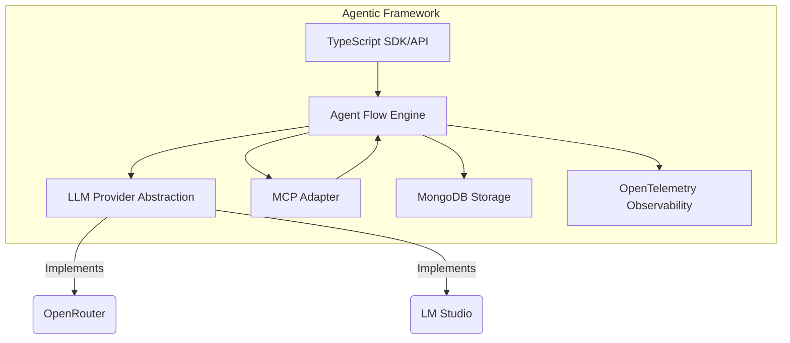

# Project Brief

## Project Overview
Project Name: Agentic  
This project aims to create a Node.js TypeScript framework for building agentic software systems. The framework will provide developers with tools and abstractions to create autonomous agents that can execute tasks, make decisions, and interact with various environments.

### Architectural Approach

#### Modular Agent Flow Definition
- Agent flows are defined as TypeScript objects (classes/interfaces) and stored in MongoDB, enabling dynamic loading and versioned schema validation.
- Flows can be imported/exported for developer ergonomics and are parsed at runtime for execution by the Agent Engine.

#### LLM Provider Abstraction
- LLM integrations use a provider pattern: all LLMs implement a common interface (e.g., OpenRouter, LM Studio, and future providers).
- Providers can be registered/unregistered dynamically, and selection is based on configuration or flow metadata.
- This enables easy extensibility for new LLMs with minimal changes.

#### Model Context Protocol (MCP) Integration Points
- MCP context can be injected at three stages: pre-LLM call (prompt augmentation), post-LLM call (response validation/enrichment), and at agent lifecycle events (initialization, per-step, per-decision).
- MCP adapters support configurable hooks for each integration point, per flow.

#### SDK API Surface
- Minimal MVP API includes:
  - `defineFlow(flowDef: AgentFlow): string` — Register a new flow.
  - `runFlow(flowId: string, input: any): FlowResult` — Execute a flow.
  - `listFlows(): AgentFlow[]` — Retrieve all defined flows.
  - `registerLLMProvider(provider: LLMProvider): void` — Add new LLMs.
  - `setMCPAdapter(adapter: MCPAdapter): void` — Plug in context sources.
- Advanced APIs allow event hooks (onStep, onDecision, onError), custom agent actions, and observability hooks.

#### Observability
- OpenTelemetry is integrated for distributed tracing, metrics, and logging.
- Instrumentation covers Agent Engine, LLM calls, MCP context injection, and flow execution.
- Custom trace attributes and span exporters are supported for user applications.

#### High-Level Modular Architecture

## Project Objectives
- Create a system for defining and executing agent flows - sequences of operations and decision points that autonomous agents can follow
- Integrate with OpenRouter API and local LM Studio to provide flexible LLM options for the MVP
- Implement support for Model Context Protocol (MCP) to augment agent capabilities with additional context and functionalities

## Scope
### In Scope
- Core agent flow definition and execution engine
- OpenRouter API integration for cloud-based LLMs
- Local LM Studio integration for offline/self-hosted LLM usage
- MCP implementation for context augmentation
- TypeScript SDK with developer documentation
- Basic logging and monitoring capabilities

### Out of Scope
- Web-based UI interface (focusing on API/SDK first)
- Advanced analytics and metrics dashboard
- Enterprise authentication systems
- [Other items excluded from this project]

## Timeline
- **Project Start Date**: April 15, 2025
- **Project End Date**: June 15, 2025 (2 months)

### Key Milestones
1. Project setup and core architecture design - April 22, 2025 (Week 1)
2. Basic agent flow engine implementation - May 6, 2025 (Week 3)
3. LLM integrations (OpenRouter and LM Studio) - May 20, 2025 (Week 5)
4. MCP integration and implementation - June 3, 2025 (Week 7)
5. Testing, documentation, and final release - June 15, 2025 (Week 8)

## Stakeholders
- **Project Sponsor**: [Name/Title]
- **Project Manager**: [Name/Title]
- **Team Members**: [Names/Titles]
- **Other Stakeholders**: [Names/Titles]

## Resources
### Budget
[Outline the budget for this project]

### Team
[List team members and their roles]

### Tools and Technology
[List tools, software, and technologies needed]

## Success Criteria
[Define how success will be measured. What specific metrics or deliverables will indicate project completion?]

## Risks and Mitigation
| Risk | Impact | Likelihood | Mitigation Strategy |
|------|--------|------------|---------------------|
| [Risk 1] | [High/Medium/Low] | [High/Medium/Low] | [Strategy] |
| [Risk 2] | [High/Medium/Low] | [High/Medium/Low] | [Strategy] |

## Communication Plan
[Outline how updates and information will be shared with stakeholders]

## Approval
| Name | Role | Signature | Date |
|------|------|-----------|------|
| | | | |
| | | | |

## Revision History
| Version | Date | Author | Description of Changes |
|---------|------|--------|------------------------|
| 1.0 | April 14, 2025 | [Author] | Initial document |